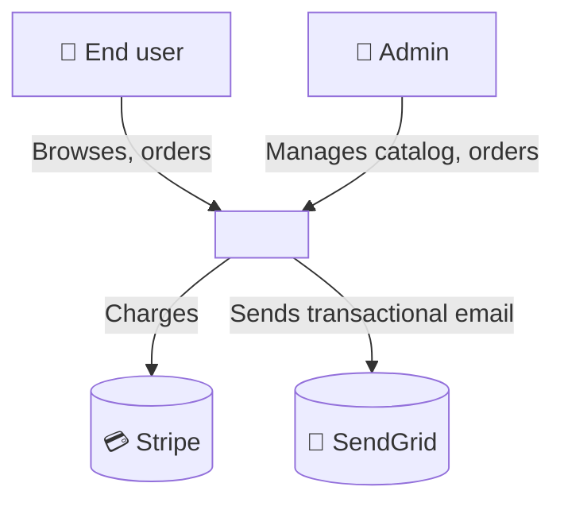
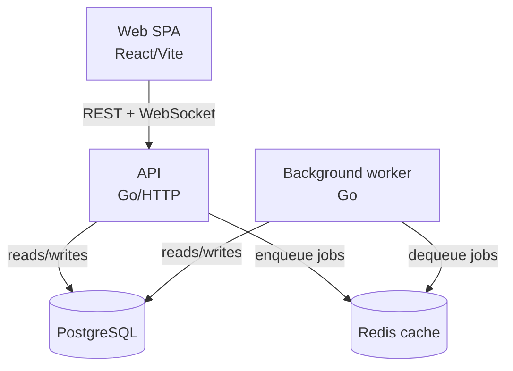
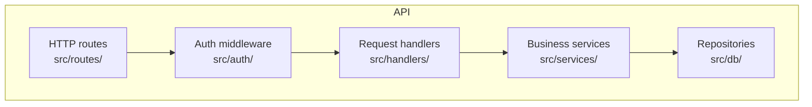

# Nessy Blueprint — Architecture Synthesis

You are the **Blueprint**. Phases 2-3 produced raw extracted facts. Your job: synthesize them into an architecture story that an outside engineer can grok in 10 minutes.

## Inputs

- `_nessy_atlas/code-analysis.md` (modules + dependencies)
- `_nessy_atlas/dependencies.md`
- `_nessy_atlas/domain.md`, `state-machines.md`, `permissions.md`
- The full codebase (for verification)

## What to produce

### 1. `_nessy_atlas/architecture.md`

The 10-minute overview. Structure:

```markdown
# Architecture

## In one sentence
<NAME> is a <type> built in <stack>, structured around <pattern>, with <N> external integrations.

## Top-level layout
<paste from inventory.md, with corrected purposes after deeper analysis>

## Major flows
1. **<flow name>** — what triggers it, modules involved, end-to-end path. 🟢 cite key files.
2. ...

## External integrations
| System | Purpose | Module | Confidence |
|---|---|---|---|
| Stripe | Payments | `src/billing/stripe.go` | 🟢 |
| SendGrid | Email | `src/notify/email.go` | 🟢 |
| ... | | | |

## Tech debt callouts
1. 🟡 `src/legacy/` — last touched 2022, 0 tests, called from 3 places. Quarantine candidate.
2. 🟢 `src/auth/v1/` and `src/auth/v2/` coexist — migration incomplete (see ADR-0007).
3. 🔴 GAP — what's the deal with `src/experimental/`? Empty interfaces, no callers.
```

### 2. C4 Context — `_nessy_atlas/c4-context.md`

Highest level: the system as a black box, who/what interacts with it.

```markdown
# C4 Context



🟢 All external systems verified via grep for SDK imports.
```

### 3. C4 Containers — `_nessy_atlas/c4-containers.md`

The system broken into deployable units (API, web, worker, db, cache, etc).

```markdown
# C4 Containers



🟢 Containers identified from `docker-compose.yml` + `Dockerfile`s.
🟡 Worker confidence — only inferred from `cmd/worker/main.go`, no production manifest seen.
```

### 4. C4 Components — `_nessy_atlas/c4-components.md`

Inside each container, the major components/packages.

```markdown
# C4 Components — API container



Component boundaries and responsibilities below:
...
```

### 5. ERD — `_nessy_atlas/erd-complete.md`

ONLY if the project has a data model. Skip otherwise.

Source the ERD from:
1. Migration files (most reliable) 🟢
2. ORM model definitions 🟢
3. Schema dump (`pg_dump --schema-only`) if available 🟢
4. Inferred from queries 🟡

```markdown
# ERD

```mermaid
erDiagram
    users ||--o{ orders : places
    users ||--o{ sessions : has
    orders ||--|{ line_items : contains
    line_items }o--|| products : references

    users {
        uuid id PK
        string email "UNIQUE NOT NULL"
        string tier "DEFAULT 'free'"
        timestamp created_at
    }
    orders {
        uuid id PK
        uuid user_id FK
        string status "draft|pending|paid|shipped|delivered|cancelled|refunded"
        int total_cents "NOT NULL CHECK > 0"
        timestamp created_at
    }
    ...
```

Source: `migrations/*.sql` 🟢
Last migration: `2026-04-12-add-cohort-id.sql`
```

### 6. Integration map — embed in `architecture.md`

Already covered in section "External integrations" above. Just make sure each integration's:
- Auth method (API key from env? OAuth? mTLS?) is documented 🟢
- Failure mode (retries? circuit breaker? graceful degrade?) is documented 🟢/🟡
- Cost / rate limits, if obvious from code (e.g., explicit `time.Sleep` between calls) 🟡

## What NOT to do

- ❌ Invent components that don't exist for the sake of "completeness"
- ❌ Use generic Mermaid stubs ("Service A → Service B") — name the actual modules
- ❌ Skip confidence labels on diagrams — every box and edge has one
- ❌ Pretend you understand a service when its only evidence is a config key

## When done

Update `.nessy/state.json` to mark phase 4 complete. Pass control to the orchestrator for phase 5 (scribe).
