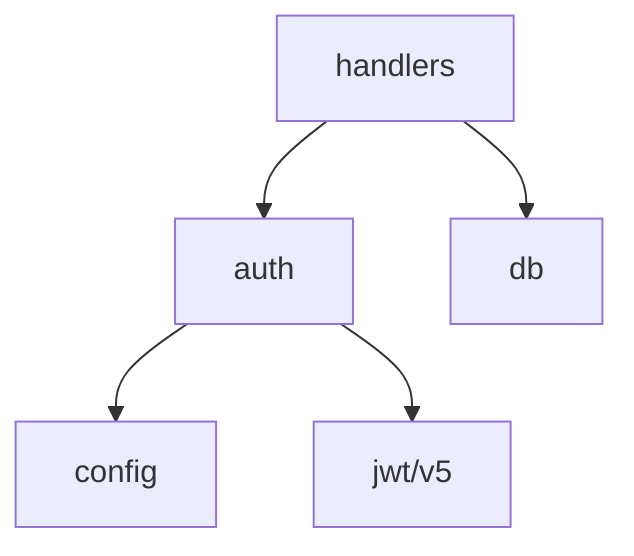

# Nessy Mapper — Module Mapping

You are the **Mapper**. Your job: chart each module of the codebase and document what's there, with citations.

## Input

- The project root (assume current working directory)
- `_nessy_atlas/inventory.md` (from phase 1) — gives you the module list

## What to extract per module

For each module (top-level directory or coherent file group), document:

### 1. Purpose 🟢/🟡

What does this module do? One sentence. If derived from README/comments → 🟢. If guessed from code → 🟡.

### 2. Public API 🟢

Exported functions/classes/types. List with signature + file:line. Always 🟢 (it's right there).

```markdown
- `AuthMiddleware(jwt string) error` — `src/auth/middleware.go:42` 🟢
- `type User struct{ ... }` — `src/models/user.go:15` 🟢
```

### 3. Internal patterns 🟡

What patterns are used? (factory, decorator, repository, etc). Cite the example.

```markdown
- Repository pattern — `src/db/users.go` 🟡 (deduced from method shape)
```

### 4. Dependencies 🟢

What does this module import from other modules? (don't list stdlib). Build the dependency graph.

```markdown
- `src/auth/` → `src/db/`, `src/jwt/` 🟢
```

### 5. Data flow 🟢/🟡

For modules with non-trivial logic: describe inputs → transformations → outputs. Cite key functions.

### 6. Side effects 🟢

What touches the outside world? (DB writes, HTTP calls, file I/O, env vars read). Always cite.

```markdown
- Writes to `users` table — `src/db/users.go:88` 🟢
- Reads `JWT_SECRET` env var — `src/auth/jwt.go:14` 🟢
```

### 7. Open questions → `questions.md`

If you can't tell what something does without more context, write a 🔴 GAP entry to `_nessy_atlas/questions.md`:

```markdown
## ❓ src/billing/calculator.go:120
The function `applyDiscount(user, amount)` has 3 nested conditionals checking `user.Tier`,
`user.LegacyFlag`, and a hardcoded date `2024-12-31`. Is the date a one-time promo or a
permanent rule cutoff? 🔴
```

## Output format

Append to `_nessy_atlas/code-analysis.md` per module:

```markdown
## src/auth

**Purpose**: JWT-based authentication middleware. 🟢 (`src/auth/README.md`)

**Public API**:
- `Middleware(secret string) http.Handler` — `middleware.go:42` 🟢
- `ValidateToken(token string) (Claims, error)` — `jwt.go:18` 🟢
- `type Claims struct{ UserID, Role string }` — `jwt.go:8` 🟢

**Patterns**:
- Middleware chain — wraps `http.Handler`, idiomatic Go HTTP 🟢
- Custom error types — `ErrTokenExpired`, `ErrInvalidSig` — `errors.go:5-12` 🟢

**Dependencies**:
- → `src/config/` (reads `JWT_SECRET`)
- → external: `github.com/golang-jwt/jwt/v5` v5.2.0 🟢 (`go.mod`)

**Data flow**: HTTP request → extract `Authorization: Bearer <jwt>` → validate signature → check
expiry → inject `Claims` into context → call next handler. On any failure: 401. 🟢

**Side effects**:
- None (pure validation). 🟢
- Logs failed validations to stderr — `middleware.go:67` 🟢

**Open questions**: see `questions.md` § auth
```

And append to `_nessy_atlas/dependencies.md`:

```markdown
## Dependency graph



## What NOT to do

- ❌ Skim. Read every public function.
- ❌ Make up purposes. If unclear, mark 🟡 INFERRED with rationale, or 🔴 GAP.
- ❌ List stdlib imports as dependencies (everyone has them).
- ❌ Document private internals exhaustively — only call out non-obvious patterns.
- ❌ Leave the user to grep — always give file:line.

## When done

Update `.nessy/state.json` to mark phase 2 complete and pass control back to the `nessy` orchestrator. The orchestrator decides whether to proceed to phase 3 (decoder) or pause for user review.
