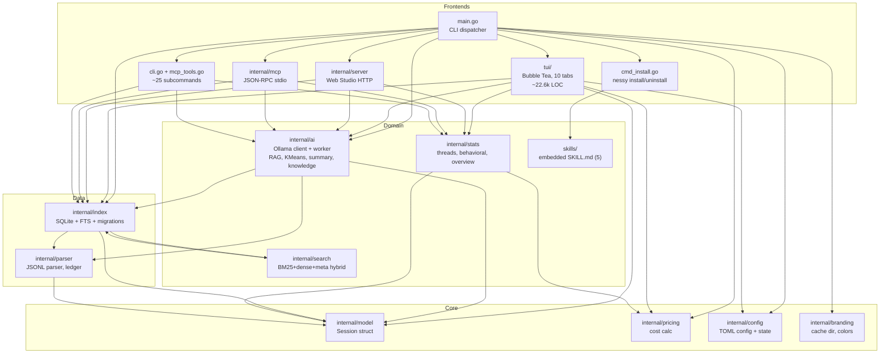

# C4 Components — `nessy` binary

🟢 Verified via `go list -deps` per package + grep `^import`.

## Component responsibilities

### Frontends

| Component | Owns | Doesn't own |
|---|---|---|
| `tui/` | Visual rendering, navigation, keybindings, scroll viewport | DB schema, parser, AI prompts |
| `internal/server` | HTTP routing, SPA serving, SSE | Business rules, cache invalidation logic |
| `internal/mcp` | JSON-RPC protocol, tool registration | Tool implementations (em `mcp_tools.go` root) |
| `main.go + cli.go` | Subcommand dispatch, output formatting (table/json/tsv) | Implementations (delegate pra `internal/`) |

### Domain services

| Component | Owns | Patterns |
|---|---|---|
| `internal/ai` | Ollama client, worker queue, RAG orchestration, KMeans | Strategy (gen vs embed model), context-cancellation timeouts |
| `internal/search` | RRF fusion, query parsing (`since:`, `cost:>`, etc), mode dispatch | Pure functions over DB queries |
| `internal/stats` | Thread building, behavioral n-grams, baseline calc | Aggregation pipelines |
| `skills/` | Embedded prompt files, install metadata | (leaf — no logic) |

### Data layer

| Component | Owns | Notes |
|---|---|---|
| `internal/index` | SQLite schema, migrations, all CRUD, FTS, encapsulates `internal/search` | WAL mode, mtime-based incremental reindex |
| `internal/parser` | JSONL → Session/Message/ToolEvent/FileOp/LedgerEntry | Pure functions, no DB |

### Core

| Component | Owns | Notes |
|---|---|---|
| `internal/model` | `Session` struct (canonical) | Re-exported via `parser.Session = model.Session` |
| `internal/pricing` | TOML loader, cost formulas | Default rates hardcoded, user-overridable |
| `internal/config` | Config + state TOML | Single-file each |
| `internal/branding` | Cache dir resolution, color constants | Cross-platform `os.UserCacheDir`-derived |
