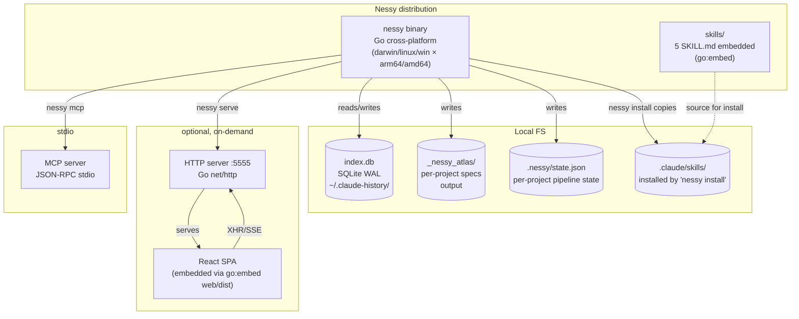

# C4 Containers

🟢 Containers identificados de:
- `.goreleaser.yaml` (binário matrix)
- `embed.go` (SPA embedded)
- `internal/server/server.go` (HTTP listener)
- `internal/mcp/server.go` (stdio JSON-RPC)
- `cmd_install.go` (skills copy logic)

## Deploy units

- **`nessy` binary** — single executable per platform (~21 MB), distribuído via:
  - GitHub Release (tar.gz/zip) 🟢 `goreleaser`
  - npm wrapper (`@felipeness/nessy` + 6 platform packages) 🟢
- **Web Studio SPA** — embedded no binário (não deploy separate). React 19 build via
  bun → Vite → embedded em Go. 🟢
- **Skills** — embedded no binário. Instaláveis on-demand em projetos via
  `nessy install`. 🟢

## Storage

- `~/.claude-history/index.db` — central cache (sessions, FTS, AI cache).
  Single-user assumption. 🟢
- `~/.claude-history/config.toml`, `pricing.toml`, `state.toml` — config + state. 🟢
- `_nessy_atlas/` (per project) — specs gerados pelo `/nessy`. Committable
  ou .gitignore (decisão do user). 🟢
- `.nessy/state.json` (per project) — pipeline state. Pequeno, normalmente
  committable. 🟢

🟡 Storage decentralization é proposital pra evitar single-DB lock contention
quando múltiplos `nessy *` rodam concorrentes. Mas adiciona complexidade —
backup precisa cobrir 3+ paths.
