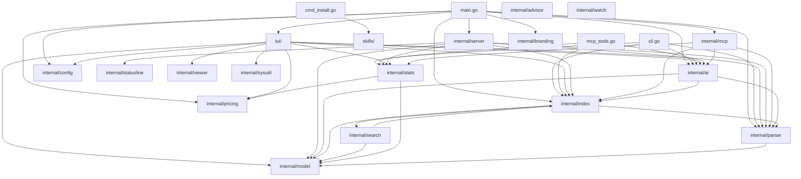

# Dependencies (Phase 2 — Mapper)

## Internal package graph



🟢 Verified by grep `^import` em cada package + `go list -deps`.

## Layered architecture (deduzido do graph)

```
┌────────────────────────────────────────────────────────────────┐
│  Frontends                                                     │
│  main.go ┬ tui/ ┬ internal/server (web) ┬ internal/mcp        │
│          └ cli.go ┴ mcp_tools.go        ┴ cmd_install.go      │
└──────────────────────────┬─────────────────────────────────────┘
                           ▼
┌────────────────────────────────────────────────────────────────┐
│  Domain services                                               │
│  internal/ai · internal/search · internal/stats · skills       │
└──────────────────────────┬─────────────────────────────────────┘
                           ▼
┌────────────────────────────────────────────────────────────────┐
│  Data layer                                                    │
│  internal/index (SQLite) · internal/parser (JSONL files)       │
└──────────────────────────┬─────────────────────────────────────┘
                           ▼
┌────────────────────────────────────────────────────────────────┐
│  Core types                                                    │
│  internal/model · internal/pricing · internal/config           │
└────────────────────────────────────────────────────────────────┘
```

🟢 Layer respeito verified — `internal/model` não importa nada de cima, etc.

## External dependencies

### Go (`go.mod` direct)

| Package | Version | Used by | Confidence |
|---|---|---|---|
| `BurntSushi/toml` | v1.6.0 | `internal/config`, `internal/pricing` (carregam .toml) | 🟢 |
| `charmbracelet/bubbletea` | v1.3.10 | `tui/` apenas | 🟢 |
| `charmbracelet/bubbles` | v1.0.0 | `tui/` (spinner) | 🟢 |
| `charmbracelet/lipgloss` | v1.1.0 | `tui/`, `internal/statusline` | 🟢 |
| `modernc.org/sqlite` | v1.50.0 | `internal/index` apenas | 🟢 |

### Indirect (via go.sum)

Charmbracelet ecosystem (x/ansi, x/cellbuf, x/term), modernc.org/libc + memory + mathutil
(SQLite runtime), mattn/go-runewidth + clipperhouse/uax29 (terminal width / unicode).

### Web (`web/package.json`)

- React 19, Vite 8, TypeScript 6, Tailwind 4 (build-time)
- Recharts 3.8 (charts em runtime)
- @dnd-kit 6/10/3 (drag-drop pra statusline editor)

### Runtime (não no binário)

- **Ollama** em `localhost:11434` — opcional, ativado via `cfg.AI.Enabled` 🟢
- **Claude CLI** (`claude`) — invocado pelo TUI pra `--resume <session>` 🟢
- **bun** (build-time only) — pra build do web frontend antes do `go build` 🟢

## Reverse dependencies (quem usa cada pacote)

- `internal/model` ← TUDO (core types)
- `internal/parser` ← `index`, `ai`, `cli`, `tui` (via index ListSessions)
- `internal/index` ← `cli`, `mcp_tools`, `tui`, `server`, `ai`, `mcpkg`
- `internal/ai` ← `cli`, `mcp_tools`, `tui`, `server`, `mcpkg`, `main`
- `internal/stats` ← `cli`, `mcp_tools`, `tui`, `server`, `mcpkg`
- `internal/search` ← apenas `internal/index` (encapsulado)
- `internal/server` ← apenas `main` (entry point)
- `internal/mcp` ← apenas `main` + `mcp_tools.go`
- `tui/` ← apenas `main`
- `skills/` ← apenas `cmd_install.go`

## Cycles?

🟢 Nenhum ciclo detectado. Architecture limpa: layers respeitadas, nenhum import upward.

## Notes / 🟡 inferences

- `internal/server` recebe `EventBroadcaster interface` do `internal/ai/worker.go` —
  desacoplamento explícito pra evitar ai → server cycle. 🟢 boa pratica.
- `internal/search` é encapsulado dentro de `internal/index` — nenhum frontend chama
  search diretamente, sempre via `*index.DB`. 🟢
- `skills/` é package "leaf" — só exporta `FS()` e `Names()`. Sem deps internos
  exceto stdlib. 🟢 Limpo.
