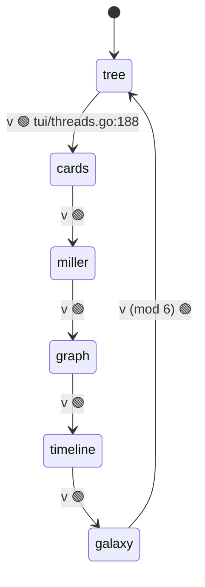
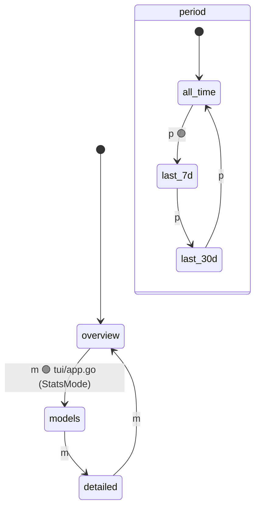
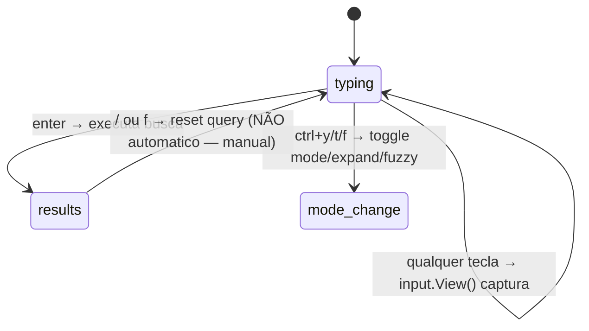
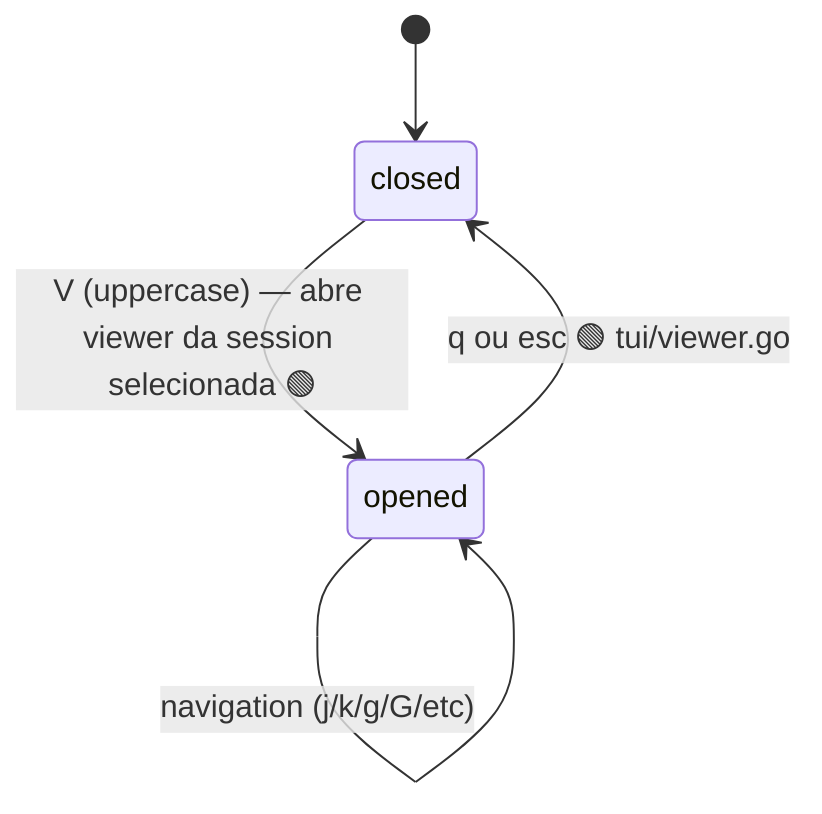
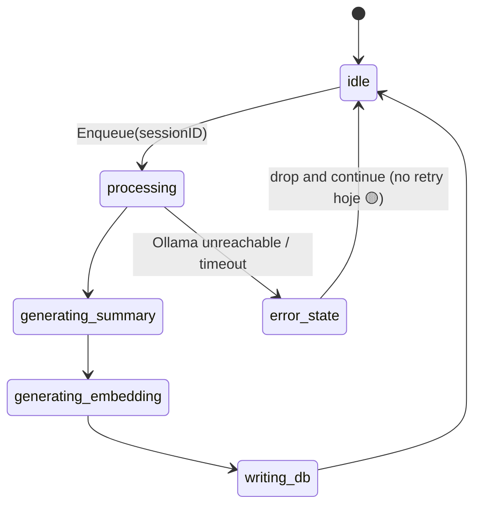
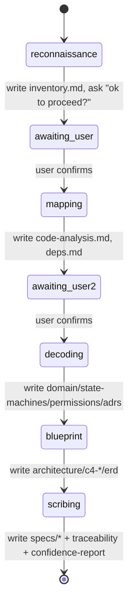
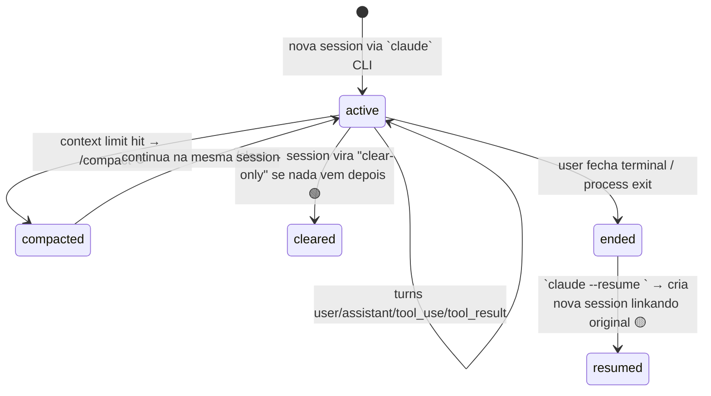

# State Machines (Phase 3 — Decoder)

## Threads view (TUI tab)

User cicla com `v` entre 6 sub-views. ToggleView é módulo 6.

🟢 Layout muda na transição: tree/cards/timeline = split (40/60 com detail panel),
miller/graph/galaxy = full-width (sem detail). Decisão em `IsFullWidth()`.

🟢 `tea.ClearScreen` disparado em ToggleView pra evitar ghost render no Windows
Terminal — `commit 6e93338`.

---

## Stats view (TUI tab)

`m` cicla mode (overview/models/detailed), `p` cicla period (all/7d/30d).
Independentes: 3×3 = 9 combinações. 🟢

---

## Search input (TUI tab)

🟡 Modos: `hybrid` (default) | `body` (FTS only) | `meta` (no body) | `sim` (semantic).
Toggle `ctrl+y` alterna fuzzy. `ctrl+t` alterna expand (mostra todos hits vs
agrupado por session).

---

## Viewer modal (overlay)

Quando `viewer.active = true`, captura TODAS as teclas (não vazam pra app).
🟢 `tui/app.go:253-258`

---

## AI worker (background)

🟢 Worker.Run loop em goroutine, started por main.go quando `cfg.AI.Enabled`.
🟡 Sem backoff explicito em failures — investigar `internal/ai/worker.go`.

---

## /nessy spec pipeline (NEW skill)

🟢 State em `.nessy/state.json` (versão 1) — `phase`, `completed_phases`,
`next_action`. Permite resume de qualquer ponto.

🟢 Após Phase 1 (recon), orchestrator PARA e pede confirmação. Outras pausas
são opcionais (user pode interromper a qualquer momento).

---

## Session lifecycle (Claude Code, externo a Nessy)

Não controlado por nós, mas relevante pra parsing:

🟡 Resume cria NEW session JSONL com referência à original, mas semantica
exata varia por versão do Claude. Nessy detecta via parser kind = "resumed".
